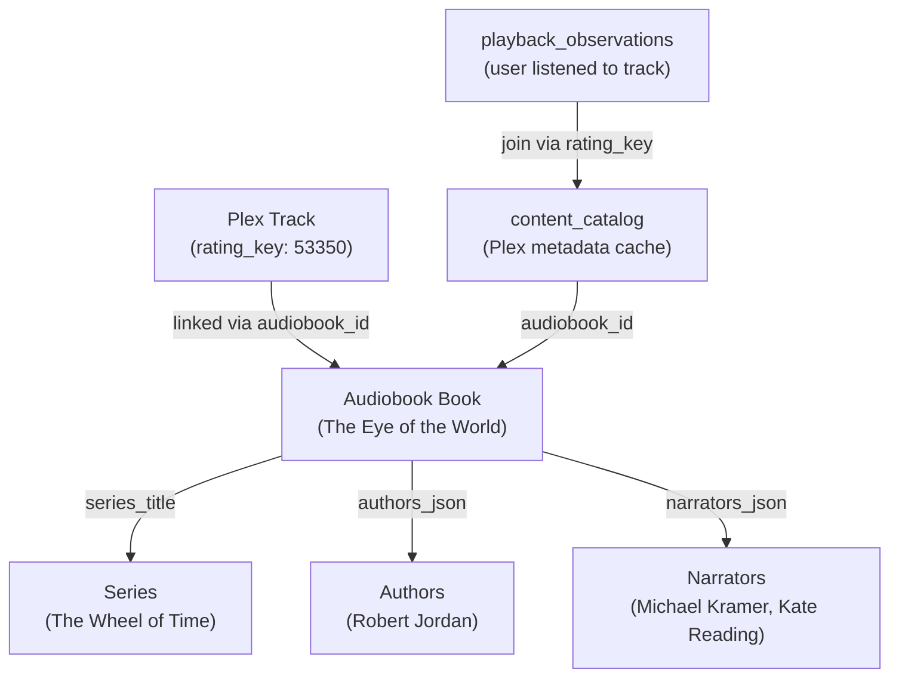
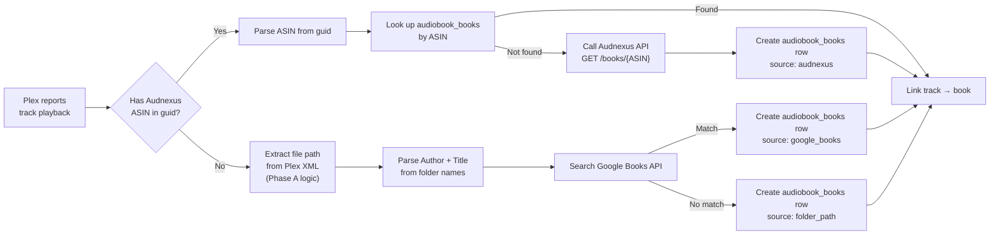

> Status: Completed on 2026-06-28.
> Result: Completed.
> Verification: `npm run build`, `npm test`, and `npm run verify:tools` passed.
> Notes: Added private Plex file-path capture, canonical audiobook grouping and enrichment, and a dry-run-first resumable backfill flow; live rollout and follow-on hierarchy cleanup were completed or split into later work.

# Block 3-1: Audiobook Differentiation & Settings

## Context

Plex natively struggles with Audiobooks, treating them as massive music albums. It relies on embedded ID3 tags rather than folder structure, causing it to merge hundreds of chapter files from different books into a single "mega-album." This leads to inaccurate co-watching data, unwanted Discord prompt spam for solo listening sessions, and unusable historical reports. To fix this, we detect audiobooks dynamically, override Plex's internal metadata with the actual folder structure, and enrich with canonical metadata from external APIs.

This block has two phases. **Phase A** extracts file paths from Plex and uses the user's folder structure to immediately fix audiobook metadata. **Phase B** introduces a dedicated audiobook schema and enriches it via external APIs (Audnexus, Google Books) so the user never has to rename a folder.

---

## Acceptance Criteria

### Phase 0: Heuristics & Settings (Complete)

- [x] **Settings Table**: `app_settings` SQLite table is created to store persistent KV config state.
- [x] **Discord Suppression**: Audiobooks default to `dismissed` for Discord prompts unless `prompt_for_audiobooks` is true.
- [x] **Audiobook Heuristics**: `IngestionService` identifies audiobooks using library names, `audnexus` guids, or track lengths > 900 seconds.
- [x] **Frontend Settings UI**: The local dashboard features a settings toggle that saves directly via `PUT /api/settings`.

### Phase A: File Path Extraction & Folder-Based Override

- [x] **Plex File Path Extraction**: `PlexAdapter` parses the raw `file="..."` attribute from the `<Part>` XML tag in Plex's response.
- [x] **Folder Path Parsing**: `MetadataService` splits the file path on `\` to extract the direct parent folder as **Book Name** and the grandparent folder as **Series/Author Name**.
- [x] **Metadata Override**: `MetadataService` forcefully overwrites Plex's messy `parentTitle` and `grandparentTitle` with the clean folder-derived names before saving to `content_catalog`.
- [x] **Retroactive Backfill (Phase A)**: One-off script to re-fetch metadata for all existing audiobook tracks and apply the folder-path override to historical data.

### Phase B: Dedicated Audiobook Schema & Smart Enrichment

- [x] **`audiobook_books` Table**: Create a dedicated canonical book registry with fields for title, subtitle, authors, narrators, series, series index, year, description, cover art, genres, language, duration, chapter count, and provenance.
- [x] **Schema Migration**: Add `audiobook_id` foreign key to `content_catalog`, add `file_path` to `content_catalog`, and keep playback queries joined through `content_catalog` rather than denormalizing `audiobook_id` onto `playback_observations`.
- [x] **ASIN Parsing**: Extract Audible ASINs from existing `plex_guid` values (format: `com.plexapp.agents.audnexus://B07286JWD3_ca/...`).
- [x] **Audnexus Enrichment**: For tracks with ASINs, call the Audnexus API (`GET /books/{ASIN}`) to fetch canonical author, narrator, series, series index, and cover art.
- [x] **Google Books Fallback**: For tracks without ASINs (`local://` guids), use the folder-parsed author + title to search the Google Books API and extract canonical metadata.
- [x] **Folder Path Fallback**: If both APIs fail, gracefully fall back to the Phase A folder-derived names with `source_provenance = 'folder_path'`.
- [x] **Retroactive Backfill (Phase B)**: Script to iterate over all existing audiobook tracks, resolve them through the enrichment pipeline, and populate `audiobook_books`.

---

## Phase A: How It Works

When Plex reports a track playback, it secretly includes the raw file path on the hard drive (e.g., `F:\Media\Audio\Audiobooks\Robert Jordan\The Wheel of Time\2021 - The Eye of the World\pt01.mp3`). Because the user's files are organized perfectly into folders, we use that structure directly:

1. **Grab the File Path:** Update `PlexAdapter` so that when it talks to Plex, it actively looks for the hidden file path in the `<Part file="...">` XML attribute.
2. **Split on Folder Slashes:** Whenever our script realizes the media is an audiobook, it looks at the path relative to the `Audiobooks` folder and splits it on either Windows or POSIX separators.
3. **Extract the Real Names:** It treats the direct parent as the **Book Name**, the first folder after `Audiobooks` as the **Author**, and the penultimate folder as an optional **Series** when enough depth exists.
4. **Override Plex:** It forcefully overwrites Plex's messy metadata with these clean, accurate folder names before saving to `content_catalog`.
5. **Retroactive Backfill:** A one-off script re-processes all existing audiobook tracks in the DB to apply the folder-path metadata fix to historical data.

### Phase A Code Changes

| Action | File | Change |
|---|---|---|
| MODIFY | `src/types/index.ts` | Add `filePath?: string` to `PlexRichMetadata` |
| MODIFY | `src/adapters/plexAdapter.ts` | In `getRichMetadataByRatingKey()`, parse the `file` attribute from the `<Part>` XML tag |
| MODIFY | `src/service/metadataService.ts` | In `savePlexMetadata()`, when `filePath` contains `Audiobooks\`, split and override `parentTitle`/`grandparentTitle` |
| NEW | `scratch/backfill-audiobooks.js` | One-off script to re-fetch and override metadata for all existing audiobook tracks |

---

## Phase B: Domain Model

An audiobook track flows through several layers of identity:



### Key Design Decisions

| Decision | Rationale |
|---|---|
| **Separate `audiobook_books` table** | `content_catalog` is one row per *track*. A "Book" groups many tracks. Dedicated table = clean canonical registry independent of Plex. |
| **`series_title` as plain text** | Series names are simple strings. A normalized `series` table adds join complexity for minimal benefit. Can add later if needed. |
| **`authors_json` / `narrators_json` as JSON arrays** | 95% of books have 1-2 authors/narrators. JSON arrays are queryable in SQLite via `json_each()`, simple, and trivial to populate from API responses. |
| **`series_index` as REAL** | Handles novellas numbered `0.5`, `2.5`, etc. |
| **`audiobook_id` only on `content_catalog`** | Deliberate avoidance of stale denormalization. Playback queries should join observations through `content_catalog` so later rematching does not strand incorrect book ids on historical observations. |

### Proposed Schema

#### New Table: `audiobook_books`

```sql
CREATE TABLE IF NOT EXISTS audiobook_books (
  id INTEGER PRIMARY KEY AUTOINCREMENT,

  -- External identifiers (for dedup and future lookups)
  asin TEXT,                                  -- Audible ASIN (primary external key)
  isbn TEXT,                                  -- ISBN-13 for cross-referencing
  google_books_id TEXT,                       -- Google Books volume ID (fallback)

  -- Core metadata
  title TEXT NOT NULL,                        -- "The Eye of the World"
  subtitle TEXT,                              -- "Book One of The Wheel of Time"
  authors_json TEXT NOT NULL DEFAULT '[]',    -- ["Robert Jordan"]
  narrators_json TEXT NOT NULL DEFAULT '[]',  -- ["Michael Kramer", "Kate Reading"]

  -- Series info (all nullable for standalone books like "Atomic Habits")
  series_title TEXT,                          -- "The Wheel of Time"
  series_index REAL,                          -- 1.0 (REAL for 0.5 novellas)

  -- Additional metadata
  year INTEGER,                               -- Publication year
  description TEXT,                           -- Book blurb/summary
  cover_url TEXT,                             -- High-res cover art URL (Audnexus)
  genres_json TEXT NOT NULL DEFAULT '[]',     -- ["Fantasy", "Science Fiction"]
  language TEXT,                              -- "en"

  -- Computed/cached (updated by backfill or on ingestion)
  total_duration_seconds INTEGER,             -- Sum of all track durations
  chapter_count INTEGER,                      -- Number of chapters/tracks

  -- Provenance & lifecycle
  source_provenance TEXT NOT NULL,            -- "audnexus" | "google_books" | "folder_path" | "manual"
  folder_path_hint TEXT,                      -- Original folder path that led to this match
  enrichment_status TEXT NOT NULL             -- "enriched" | "partial" | "pending"
    DEFAULT 'pending',
  created_at TEXT NOT NULL,
  updated_at TEXT NOT NULL
);

-- Indexes
CREATE UNIQUE INDEX IF NOT EXISTS idx_ab_asin
  ON audiobook_books(asin) WHERE asin IS NOT NULL;
CREATE INDEX IF NOT EXISTS idx_ab_series
  ON audiobook_books(series_title) WHERE series_title IS NOT NULL;
CREATE INDEX IF NOT EXISTS idx_ab_enrichment
  ON audiobook_books(enrichment_status);
```

#### Altered Table: `content_catalog`

```sql
ALTER TABLE content_catalog ADD COLUMN audiobook_id INTEGER
  REFERENCES audiobook_books(id);
ALTER TABLE content_catalog ADD COLUMN file_path TEXT;
```

#### Playback Join Strategy

```sql
-- Keep playback_observations unchanged.
-- Join observations through content_catalog.rating_key -> content_catalog.audiobook_id.
```

### Enrichment Pipeline



> [!IMPORTANT]
> Use the dry-run backfill output as the source of truth for current ASIN, pending, and failure counts. Do not rely on stale fixed inventory claims in this block file.

---

## Edge Cases Addressed

| Edge Case | How It's Handled |
|---|---|
| **Standalone books** (Atomic Habits) | `series_title` and `series_index` are nullable |
| **Multiple authors** (Robert Jordan & Brandon Sanderson) | `authors_json`: `["Robert Jordan", "Brandon Sanderson"]` |
| **Multiple narrators** (Michael Kramer, Kate Reading) | `narrators_json`: `["Michael Kramer", "Kate Reading"]` |
| **Novella numbering** (Book 0.5, 2.5) | `series_index` is REAL, not INTEGER |
| **Duplicate author folders** (4 variants of "Robert Jordan") | All resolve to the same ASIN → same `audiobook_books` row |
| **Re-downloads / different editions** | Same ASIN → same row. Different ASINs for same work are separate rows (acceptable for now) |
| **Tracks with no ASIN** (`local://` guid) | Fallback: parse file path → search Google Books → `source_provenance = 'folder_path'` or `'google_books'` |
| **Audnexus API down** | `enrichment_status = 'pending'` → retry later. Folder path metadata still usable immediately via Phase A |
| **Sub-series** (Mistborn Era 1 vs Era 2) | `series_title` stores the immediate series. We don't model meta-series (Cosmere) |
| **Anthologies** (Arcanum Unbounded) | Treated as a single book with its own entry |
| **Book listened to twice** | `playback_observations` naturally has multiple rows. Progress query uses `MAX(view_offset)` per track |

## Intentionally Deferred

- **Chapter-level mapping**: Plex tracks don't map 1:1 to chapters. Not worth the complexity now.
- **Meta-series / Universes**: Cosmere, Discworld sub-series. We store the immediate series only.
- **Reading lists / recommendations**: Out of scope for `plex-cowatcher`.
- **Multi-user book ownership**: We track *listening* per user, not ownership.

## Risks

- **Folder Structure Assumptions (Phase A)**: The logic assumes a strict folder structure (e.g., `.../Audiobooks/Author/Book/Track.mp3`). If some audiobooks are just loose files, the parser must safely fall back to standard Plex metadata.
- **Audnexus API Availability (Phase B)**: The curl test to `api.audnex.us` timed out after 5 minutes. If the public API is unreliable, we may need to self-host it (it's open-source and Docker-ready) or lean on Google Books as primary.
- **Google Books API Rate Limits**: The free tier allows ~1,000 requests/day. The backfill script must cache results per *Book folder*, not per *Track*, to stay within limits.

## Open Questions

- **Audnexus reliability**: Should we attempt Audnexus first and fall back gracefully, or self-host it from the start?
